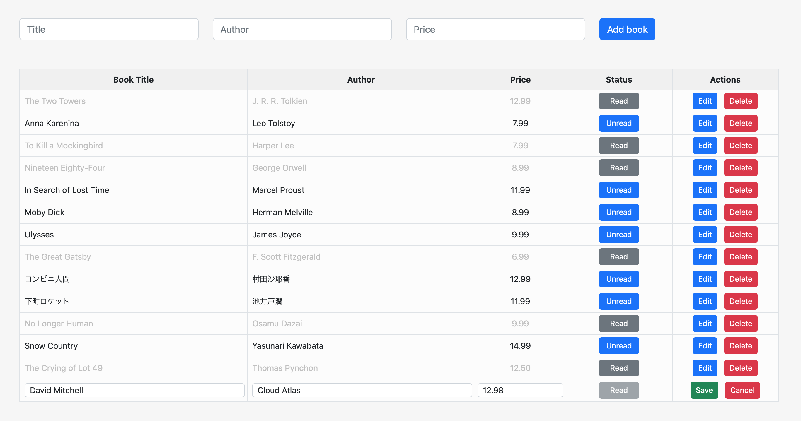

## django_htmx_books

Simple CRUD app for managing a table of books. 
Built using Django and HTMX. 
HTMX is used to enable AJAX requests and thereby avoid full page reloads. 
Based on and extended form this [Code With Stein](https://www.youtube.com/watch?v=Pr8z9XxyrJc&t=3s) video tutorial.

